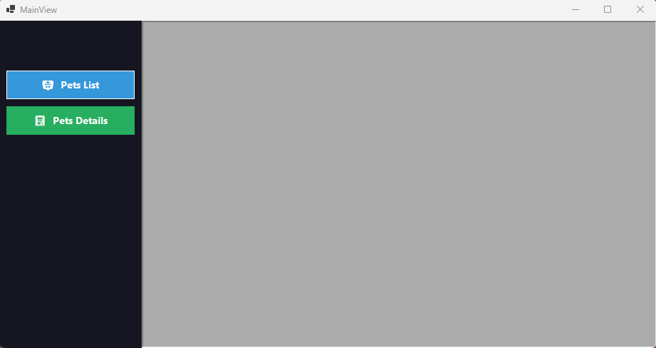
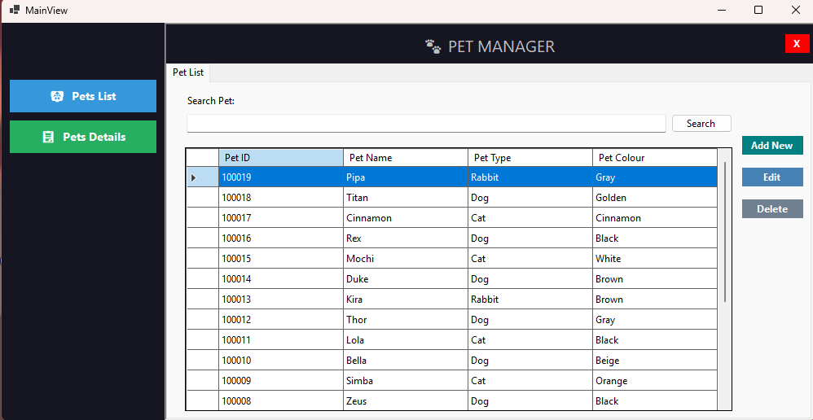
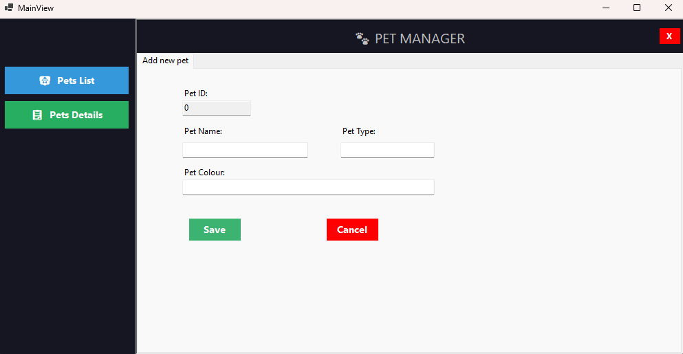

# 🐾 CRUD WinForms MVP — Gestor de Mascotas Veterinario


Aplicación de escritorio en **Windows Forms** con **.NET 9** que implementa el patrón de diseño **MVP (Model-View-Presenter)** realizando operaciones CRUD completas contra una base de datos **SQL Server**.

---

## 📸 Capturas de Pantalla

<!-- Captura de la ventana principal -->


<!-- Captura del listado de mascotas -->


<!-- Captura del formulario de detalle -->


---

## 📋 Tabla de Contenidos

- [Descripción General](#-descripción-general)
- [Arquitectura](#-arquitectura)
- [Estructura del Proyecto](#-estructura-del-proyecto)
- [Requisitos Previos](#-requisitos-previos)
- [Configuración de la Base de Datos](#-configuración-de-la-base-de-datos)
- [Configuración de la Conexión](#-configuración-de-la-conexión)
- [Cómo Ejecutar](#-cómo-ejecutar)
- [Funcionalidades](#-funcionalidades)
- [Tecnologías Utilizadas](#-tecnologías-utilizadas)
- [Recomendación de .gitignore](#-recomendación-de-gitignore)

---

## 📝 Descripción General

Este proyecto gestiona un catálogo de **Mascotas** para un sistema veterinario. Permite al usuario registrar, actualizar, eliminar y buscar mascotas a través de una interfaz Windows Forms. La aplicación aplica el patrón **MVP** para separar las responsabilidades, manteniendo la lógica de negocio completamente independiente de la capa de presentación.

---

## 🏗️ Arquitectura

```
┌──────────────────────────────────────────────────────┐
│                    Vistas (UI)                        │
│          MainView  ◄──────────►  PetView              │
│        (IMainView)              (IPetView)            │
└──────────────────┬──────────────────┬───────────────┘
                   │  Eventos         │  Propiedades
┌──────────────────▼──────────────────▼───────────────┐
│                  Presentadores                        │
│        MainPresenter  ◄──────►  PetPresenter          │
│                    ModelDataValidation                │
└──────────────────────────────┬──────────────────────┘
                               │  Interfaz
┌──────────────────────────────▼──────────────────────┐
│              Repositorios (Acceso a Datos)            │
│        BaseRepository  ◄──  PetRepository             │
│             (IPetRepository / ADO.NET)                │
└──────────────────────────────────────────────────────┘
                               │
               ┌───────────────▼──────────────┐
               │   SQL Server (VeterinaryDb)   │
               └──────────────────────────────┘
```

**Responsabilidades por capa:**

| Capa | Responsabilidad |
|---|---|
| 🧩 **Model** | Estructura de datos (`PetModel`) y contrato del repositorio (`IPetRepository`) |
| 🖥️ **View** | Formularios e interfaces (`IMainView`, `IPetView`) — sin lógica de negocio |
| 🎯 **Presenter** | Orquesta eventos, llama al repositorio y actualiza la vista |
| 🗄️ **Repository** | Consultas ADO.NET directas contra SQL Server |

---

## 📁 Estructura del Proyecto

```
CRUDWinFormsMVP/
│
├── 🧩 Models/
│   ├── PetModel.cs          # Modelo de datos con validaciones
|   |                          └-> (DataAnnotations)
│   └── IPetRepository.cs         # Contrato del repositorio (interfaz)
│
├── 🖥️ Views/
│   ├── IMainView.cs           # Interfaz de la ventana principal
│   ├── IPetView.cs               # Interfaz del formulario de mascotas
│   ├── MainView.cs / .Designer   # Formulario de navegación principal
│   └── PetView.cs / .Designer   # Formulario CRUD de mascotas
│                                  └-> (pestañas lista + detalle)
├── 🎯 Presenters/
│   ├── MainPresenter.cs  # Conecta navegación MainView → PetView
│   ├── PetPresenter.cs        # Maneja todas las acciones CRUD 
│   └── Common/
│       └── ModelDataValidation.cs  # Validador reutilizable con DataAnnotations
│
├── 🗄️ _Repositories/
│   ├── BaseRepository.cs # Base abstracta con cadena de conexión
│   └── PetRepository.cs        # Implementación CRUD con ADO.NET
│
├── ⚙️ App.config        # Configuración de la cadena de conexión
├── 🚀 Program.cs        # Punto de entrada + inyección de
|                                           dependencias manual
└── 📦 CRUDWinFormsMVP.csproj
```

---

## ✅ Requisitos Previos

- [.NET 9 SDK](https://dotnet.microsoft.com/download/dotnet/9)
- [Visual Studio 2022](https://visualstudio.microsoft.com/) o superior con el workload **Windows Forms**
- Instancia de **SQL Server** o **SQL Server Express**

---

## 🗄️ Configuración de la Base de Datos

Ejecuta el siguiente script en tu instancia de SQL Server para crear la base de datos y la tabla:

```sql
CREATE DATABASE VeterinaryDb;
GO

USE VeterinaryDb;
GO

CREATE TABLE Pet (
    Pet_Id     INT           IDENTITY(1,1) PRIMARY KEY,
    Pet_Name   NVARCHAR(50)  NOT NULL,
    Pet_Type   NVARCHAR(50)  NOT NULL,
    Pet_Colour NVARCHAR(50)  NOT NULL
);
```

---

## ⚙️ Configuración de la Conexión

Abre `App.config` y actualiza la cadena de conexión con los datos de tu servidor:

```xml
<connectionStrings>
  <add name="SqlConnection"
       connectionString="Data Source=TU_SERVIDOR\SQLEXPRESS;
                         Initial Catalog=VeterinaryDb;
                         User ID=tu_usuario;
                         Password=tu_contraseña;
                         TrustServerCertificate=True"
       providerName="System.Data.SqlClient" />
</connectionStrings>
```

> 💡 **Autenticación de Windows:** Si usas autenticación integrada, reemplaza `User ID` y `Password` por `Integrated Security=True`.

---

## 🚀 Cómo Ejecutar

**Línea de comandos:**

```bash
# Clonar el repositorio
git clone https://github.com/tu-usuario/CRUDWinFormsMVP.git
cd CRUDWinFormsMVP/CRUDWinFormsMVP

# Restaurar paquetes y compilar
dotnet restore
dotnet build

# Ejecutar la aplicación
dotnet run
```
---

## ✨ Funcionalidades

| Función | Descripción |
|---|---|
| 📋 **Listar mascotas** | Muestra todos los registros en un `DataGridView`, ordenados por ID descendente |
| 🔍 **Buscar** | Filtra mascotas por ID numérico o por nombre (búsqueda por prefijo) |
| ➕ **Agregar mascota** | Registra una nueva mascota con nombre, tipo y color |
| ✏️ **Editar mascota** | Carga el registro seleccionado en el formulario y permite modificarlo |
| 🗑️ **Eliminar mascota** | Borra el registro seleccionado de la base de datos |
| 🛡️ **Validación de datos** | Campos requeridos y longitud mínima/máxima controlados por `DataAnnotations` |
| 🗂️ **Navegación por pestañas** | `PetView` tiene pestañas separadas de **Lista** y **Detalle** |
| 🪟 **Patrón Singleton en vistas** | `PetView.GetInstance()` reutiliza la ventana abierta en lugar de crear duplicados |

---

## 🛠️ Tecnologías Utilizadas

| Tecnología | Versión |
|---|---|
| .NET / WinForms | 9.0 |
| C# | 13 |
| ADO.NET (`System.Data.SqlClient`) | 4.9.1 |
| System.ComponentModel.Annotations | 5.0.0 |
| System.Configuration.ConfigurationManager | 10.0.8 |
